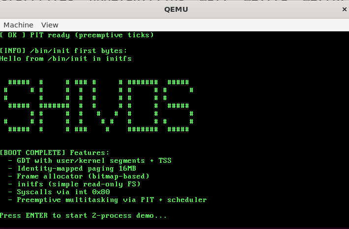
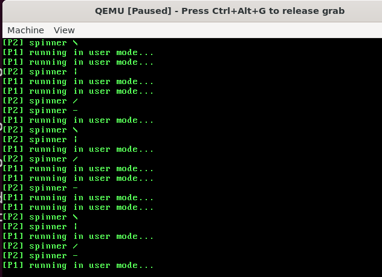

ShiveshOS is a small 32-bit x86 OS built from scratch while following *The Little Book About OS Development* and then extended with:

- real kernel/user privilege separation (GDT + TSS),
- paging with a frame allocator,
- an embedded init filesystem, and
- preemptive multitasking between user processes.

It boots directly under QEMU, shows a boot log + ASCII banner, and then runs two user-mode processes that are time-sliced by the PIT.

---

## Screenshots

### Boot + Banner



### Two User Processes (P1 / P2) Multitasking



---

## What’s Implemented

### CPU & Privilege

- 32-bit **protected mode**.
- **GDT** with separate kernel and user segments:
  - Kernel code/data (ring 0)
  - User code/data (ring 3)
- **TSS (Task State Segment)**:
  - On every transition from ring 3 → ring 0 (interrupts, syscalls), the CPU automatically switches to a dedicated kernel stack.

### Memory Management

- **Paging** with identity mapping of the low 16 MB:
  - 1 page directory
  - 4 page tables (4 × 4 MB regions)
- Simple **bitmap-based frame allocator**:
  - Manages 4 KB frames.
  - Initialized just after `kernel_end` so the kernel never allocates over itself.

### Interrupts, PIT & Syscalls

- **IDT** with 256 entries:
  - CPU exceptions 0–31 go to a common C handler (“CPU exception” + halt).
  - PIC remapped so hardware IRQs live at \`0x20–0x2F\`:
    - IRQ0 (0x20): PIT timer
    - IRQ1 (0x21): Keyboard
- **PIT (Programmable Interval Timer)**:
  - Programmed to fire at 50 Hz.
  - Each timer interrupt calls \`scheduler_tick()\` to drive preemptive multitasking.
- **Syscalls** via \`int 0x80\` (gate DPL=3 so user code can call):
  - \`SYS_WRITE\` – write a buffer to the VGA text framebuffer.
  - \`SYS_EXIT\` – terminate the current process and switch to the next runnable one.
  - \`SYS_YIELD\` – cooperative yield into the scheduler.
  - \`SYS_SPAWN\` – create a fresh user process with its own user-mode stack.

### Processes & Scheduling

- Fixed-size **process table** (\`MAX_PROCS\`) with states:
  - \`PROC_UNUSED\`, \`PROC_RUNNABLE\`, \`PROC_ZOMBIE\`
- Each \`struct process\` contains:
  - Saved **register context** (\`struct regs\`) used by the interrupt/syscall stubs.
  - A **kernel stack** and a **user stack**.
- **Round-robin scheduler**:
  - On each timer tick, \`scheduler_tick()\` saves the current process’s context and selects the next runnable process.
  - Context switching is done via the saved \`struct regs\` frame and \`iret\`.

### initfs (Embedded Read-only Filesystem)

- A small **initfs image** is built at compile time and linked into the kernel:
  - Built by \`tools/mkinitfs\`.
  - Exposed as a simple read-only filesystem in memory.
- Kernel looks up and reads \`/bin/init\` on boot to demonstrate file access.

---

## Demo Flow

On a normal run, you see:

1. **Boot log** messages showing:
   - GDT/TSS setup  
   - Frame allocator + paging initialization  
   - IDT + PIC setup  
   - initfs and PIT initialization  
2. The **ShiveshOS ASCII banner**.
3. A **“Press ENTER”** prompt.
4. After ENTER:
   - Screen clears.
   - The kernel starts a demo with two user-mode processes (\`user_proc1\` and \`user_proc2\`).
   - They print \`P1\` / \`P2\` (or similar markers) to the framebuffer while the PIT + scheduler preemptively context-switch between them.

This gives a clear visual of:
- boot sequence,
- kernel → user transition,
- and preemptive multitasking.

---

## Build & Run

From the project root:

```bash
make
qemu-system-i386 -kernel kernel.elf -serial file:serial.log -monitor stdio 
and you can inspect serial.log files for outputs. 